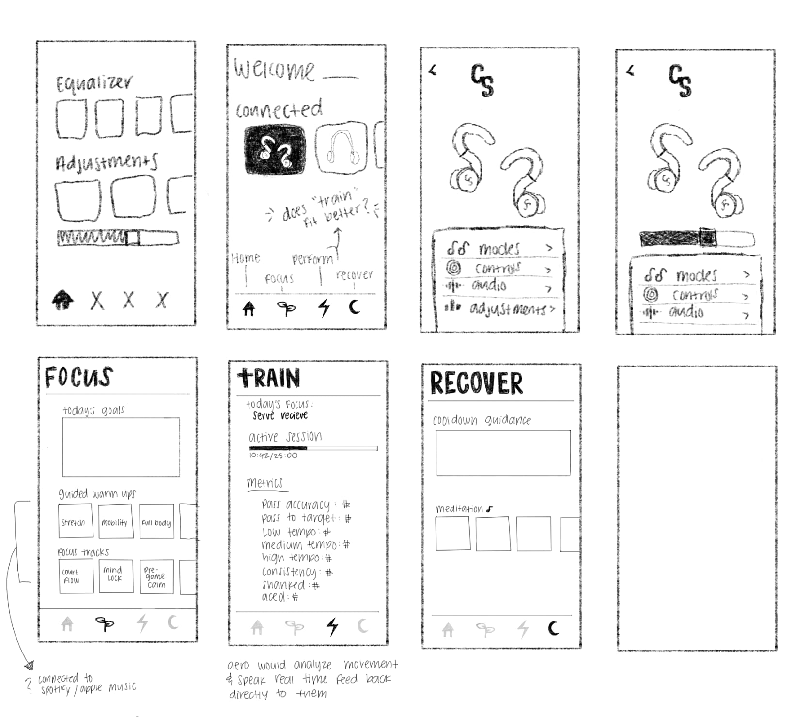

import SectionTitle from '../../components/case/SectionTitle.astro';
import SectionNav from '../../components/case/SectionNav.astro';
import SwipeCards from '../../components/case/SwipeCards.astro';
import Panel from '../../components/case/Panel.astro';
import ColorStory from '../../components/case/ColorStory.astro';
import BrandBoard from '../../components/projects/courtsync/BrandBoard.astro';
import LogoAnatomy from '../../components/projects/courtsync/LogoAnatomy.astro';
import SlideStack from '../../components/case/SlideStack.astro';
import Slide from '../../components/case/Slide.astro';
import PersonaProfile from '../../components/case/PersonaProfile.astro';
import PhoneRow from '../../components/case/PhoneRow.astro';
import AeroIntro from '../../components/projects/courtsync/AeroIntro.astro';
import ColorPicker from '../../components/case/ColorPicker.astro';
import ProductCallouts from '../../components/case/ProductCallouts.astro';
import syncProsWordmark from '../../assets/projects/courtsync/syncpros-wordmark.svg';
import BrowserFrame from '../../components/case/BrowserFrame.astro';
import earbudsBlack from '../../assets/projects/courtsync/earbuds-black.png';
import earbudsSilver from '../../assets/projects/courtsync/earbuds-silver.png';
import earbudsWhiteColor from '../../assets/projects/courtsync/earbuds-white.png';
import earbudsBlue from '../../assets/projects/courtsync/earbuds-blue.png';
import earbudsGreen from '../../assets/projects/courtsync/earbuds-green.png';
import launchSite from '../../assets/projects/courtsync/launch-site.jpg';
import personaRachel from '../../assets/projects/courtsync/persona-rachel.jpg';
import appHome from '../../assets/projects/courtsync/app-home.jpg';
import appFocus from '../../assets/projects/courtsync/app-focus.jpg';
import appPerform from '../../assets/projects/courtsync/app-perform.jpg';
import appRecover from '../../assets/projects/courtsync/app-recover.jpg';

<SectionNav
  items={[
    { label: 'Deliverables', href: '#overview' },
    { label: 'Branding & Strategy', href: '#branding' },
    { label: 'Product Design', href: '#product-design' },
    { label: 'Software Design', href: '#software-design' },
    { label: 'Launch Website', href: '#launch-website' },
  ]}
/>

<SectionTitle id="overview" accent={2}>Overview</SectionTitle>

The brief: conceptualize, design and launch a new headphone product. Beyond the user experience, that meant crafting a brand narrative, designing the physical product with AI tools, and building a launch website that tells a story and builds anticipation, simulating a real-world launch where visual design, branding and storytelling capture the market's attention.

<SwipeCards
  label="Deliverables"
  accent={2}
  items={[
    { title: 'Branding & Strategy', text: 'A complete brand identity with a clear reason to exist.', items: ['Company name and logo', 'Company backstory', 'User persona', 'Value proposition'] },
    { title: 'Product Design', text: 'An earbud concept brought to life with AI tools.', items: ['Earbud concept', '3–5 AI-generated renderings', 'Lifestyle shots in context'] },
    { title: 'Software Design', text: 'A simple companion app that reflects the brand.', items: ['2–3 key app screens', 'Settings and controls'] },
    { title: 'Launch Website', text: 'A responsive landing page that builds anticipation.', items: ['Product story', 'Key features', 'Pre-order'] },
    { title: 'Launch Talk', text: 'A scripted presentation that simulates a live launch event.', items: ['Brand and product', 'App and website', 'Launch slides'] },
  ]}
/>

<SectionTitle id="branding" accent={1}>Branding & Strategy</SectionTitle>

### Brand concept

CourtSync embodies synchronization between athletes, movement and performance. The name and design reflect the idea of connecting mind and body through intelligent audio technology.

The brand voice is bold, athletic and modern, made for serious court athletes who thrive on precision and rhythm.

<ul class="tag-list" aria-label="Brand voice">
  <li class="tag">Bold</li>
  <li class="tag">Athletic</li>
  <li class="tag">Modern</li>
</ul>

<BrandBoard />

<Panel eyebrow="Logo" title="The wordmark combines strength and motion" highlight="motion">
  <LogoAnatomy />
</Panel>

### Color palette

Each color represents a stage in the athlete's performance cycle: focus, perform, recover. Together, the palette blends sport energy with tech intelligence: bold but clean, athletic yet futuristic.

<ColorStory
  items={[
    { label: 'Focus', name: 'Charged Lime', hex: '#BFFF65', ink: '#000000', text: 'Bright and alert, tied to focus and mental clarity during pre-game preparation.' },
    { label: 'Perform', name: 'Pulse Green', hex: '#3ADE6B', ink: '#000000', text: 'Energizing and dynamic, representing performance and movement on the court.' },
    { label: 'Recover', name: 'Sync Blue', hex: '#015AFF', ink: '#FFFFFF', text: 'Recovery, calm and rhythm: the “sync” between the athlete’s body and technology.' },
  ]}
  neutrals={[
    { name: 'Core Black', hex: '#000000', ink: '#FFFFFF' },
    { name: 'Refreshed White', hex: '#FFFFFF', ink: '#000000' },
  ]}
  neutralsText="Grounding and contrast, reinforcing professionalism and balance across every application."
/>

### Overall brand message

<blockquote>
  
CourtSync is where human performance meets intelligent design.

  
The brand empowers athletes to move in sync with their training, through data, rhythm and recovery, creating a seamless feedback loop between body and technology.

</blockquote>

<SlideStack>
<Slide title="Problem" bg="#000000" ink="#FFFFFF" accent="#015AFF">

Athletes on the volleyball court train through a full cycle of preparation, performance and recovery.

Yet most headphones designed for sports only deliver music during the workout, **ignoring the critical moments before and after.**

Without guided focus, real-time coaching or structured recovery, athletes miss opportunities to maximize performance and protect long-term health.

</Slide>
<Slide title="Concept" bg="#015AFF" ink="#FFFFFF">

CourtSync are smart headphones built for court athletes that guide you through the full cycle of training: focus before, perform during and recover after.

- **Focus:** Prep Mode sharpens body and mind with guided warmups, breath pacing and focus tracks.
- **Perform:** The AI Training Partner monitors form, pace and heart rate, delivering real-time coaching feedback.
- **Recover:** Recovery Mode restores balance with cooldown guidance, binaural beats and heart-rate-based relaxation.

</Slide>
<Slide title="Mission" bg="#FFFFFF" ink="#000000" accent="#015AFF">

At CourtSync, we believe true performance is **built before, during and after** when it comes to playing volleyball.

**Our mission is to help court athletes focus, perform and recover through intelligent audio and AI coaching.**

</Slide>
<Slide title="Value Proposition" bg="#08E249" ink="#000000">

CourtSync is the **only smart system** that supports the **full cycle** of performance.

Unlike standard sport headphones that only play music, CourtSync combines intelligent audio with AI coaching to help athletes focus before, perform at their peak during and recover smarter after.

</Slide>
</SlideStack>

<Panel level={2} tone="light" eyebrow="User persona" title="Who CourtSync is for" highlight="CourtSync">
  <PersonaProfile
    name="Rachel Smith"
    image={personaRachel}
    imageAlt="Black-and-white photo of a volleyball player bumping the ball on an outdoor court"
    imageFocus="50% 75%"
    facts={[
      { label: 'Age', value: '18' },
      { label: 'Education', value: 'High School' },
      { label: 'Location', value: 'Missouri' },
      { label: 'Sport', value: 'Club & High School VB' },
    ]}
    sections={[
      { title: 'Lifestyle', text: 'Practices 5–6 days a week, **balancing intense training with school.** Travels for matches and tournaments. Uses gear that supports peak focus, precision and endurance on and off the court.' },
      { title: 'Goals', items: ['Stay mentally sharp and physically prepared year-round.', 'Improve athletic performance and track progress.', 'Use tech that simplifies rather than complicates training.', '**Prepare for higher level training.**'] },
      { title: 'Frustrations', items: ['Struggles to find useful tools that balance performance and rest.', 'Switching between multiple apps for warmup, coaching and recovery is a hassle.', '**Earbuds that fall out of the ears mid workout.**'] },
    ]}
  />
</Panel>

<SectionTitle id="product-design" accent={1}>Product Design</SectionTitle>

SyncPros earbuds were designed with AI tools, with secure ear hooks for athletes whose earbuds fall out mid-workout, and come in five colorways.

{/* Stage is the Figma frame from y 90 to 910 (1920 × 820); positions are % of that */}
<ProductCallouts
  ratio="1920 / 820"
  wordmark={syncProsWordmark}
  wordmarkAlt="SyncPros"
  wordmarkBox={{ left: 41, top: 4.3, width: 18.3 }}
  image={earbudsBlack}
  imageAlt="SyncPros earbuds in Core Black with callouts to their features"
  imageBox={{ left: 36.2, top: 21.6, width: 30.5 }}
  callouts={[
    { title: 'Sweat & Water Resistance', text: 'Earbuds are durable enough to transition seamlessly to the court.', side: 'left', y: 34.6, from: 30.7, to: 38.4 },
    { title: 'Hyper-soft Cushioning', text: 'Enables true all-day wear comfort by eliminating common pressure points while allowing precise customization for any ear shape.', side: 'left', y: 61.8, from: 30.7, to: 38.4 },
    { title: 'Secure Flex Hook', text: 'Guarantees a non-slip, secure fit that stays put through intense movement.', side: 'right', y: 45.9, from: 61.7, to: 69.4 },
    { title: 'Intuitive Sync Touch Control', text: 'The outer surface of the earbud is a customizable touch interface that registers multi-tap and swipe gestures.', side: 'right', y: 85.5, from: 61.7, to: 69.4 },
  ]}
/>

<ColorPicker
  label="Colorways"
  items={[
    { name: 'Core Black', description: 'Sleek matte finish with stealth aesthetics', swatch: 'linear-gradient(135deg, #1e2939, #000000)', image: earbudsBlack, alt: 'SyncPros earbuds in Core Black with the CS logo' },
    { name: 'Sleek Silver', description: 'Brushed metal with premium feel', swatch: 'linear-gradient(135deg, #d4d4d4, #8a8a8a)', image: earbudsSilver, alt: 'SyncPros earbuds in Sleek Silver with the CS logo' },
    { name: 'Refreshed White', description: 'Classic clean look with glossy finish', swatch: 'linear-gradient(135deg, #ffffff, #f0f0f0)', image: earbudsWhiteColor, alt: 'SyncPros earbuds in Refreshed White with the CS logo' },
    { name: 'Sync Blue', description: 'Sync blue with premium gloss', swatch: 'linear-gradient(135deg, #bfd5ff, #3d81ff)', image: earbudsBlue, alt: 'SyncPros earbuds in Sync Blue with the CS logo' },
    { name: 'Pulse Green', description: 'Fresh mint with soft-touch coating', swatch: 'linear-gradient(138deg, #dcffe6, #53ff87)', image: earbudsGreen, alt: 'SyncPros earbuds in Pulse Green with the CS logo' },
  ]}
/>

<SectionTitle id="software-design" accent={1}>Software Design</SectionTitle>

### Wireframes

I started on paper, sketching the home screen, earbud settings and the three training modes: Focus, Train and Recover. The notes capture early decisions, like Aero analyzing movement and speaking real-time feedback directly to the athlete, and connecting focus tracks to Spotify or Apple Music.

<Panel eyebrow="App" title="The CourtSync app" highlight="app">
  <PhoneRow
    items={[
      { image: appHome, alt: 'CourtSync home screen: connected Sync Pros, today’s progress, this week’s sessions and recent sessions', title: 'Home screen', text: 'is an overview of the athlete’s progress, showing today’s progress and logged sessions from the week with improvement.' },
      { image: appFocus, alt: 'Focus screen: breath pacing options and guided warm-ups with play buttons', title: 'Focus Mode', text: 'helps athletes warm up before with breath pacing, guided stretches and curated playlists to enhance performance.' },
      { image: appPerform, alt: 'Perform screen: Aero Performance Tracking with jump vertical, hitting power, block height and arm swing', title: 'Perform Mode', text: 'uses AI to track form, pace and heart rate in real time, while giving the athlete feedback in their ear.' },
      { image: appRecover, alt: 'Recover screen: recovery status, sleep and readiness score, and guided cool downs', title: 'Recover Mode', text: 'supports post-training balance with guided cooldown videos, recovery yoga and relaxation tools.' },
    ]}
  />
</Panel>

<AeroIntro />

<SectionTitle id="launch-website" accent={1}>Launch Website</SectionTitle>

A responsive landing page that introduces SyncPros, tells the story behind the product, highlights its key features and lets athletes pre-order.

<BrowserFrame
  image={launchSite}
  url="courtsync.com"
  alt="CourtSync launch website: SyncPros hero with a volleyball player, the earbuds, The Complete Training Cycle with focus, perform and recover cards, Meet Aero, action photos, a pre-order section with five colorways, features that redefine training, and the CourtSync footer"
/>

{/* Next sections are added one at a time, following the Figma slides from the top. */}
