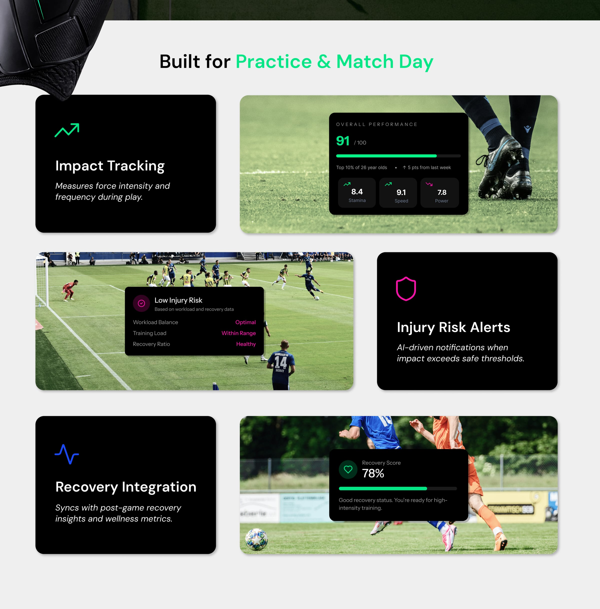
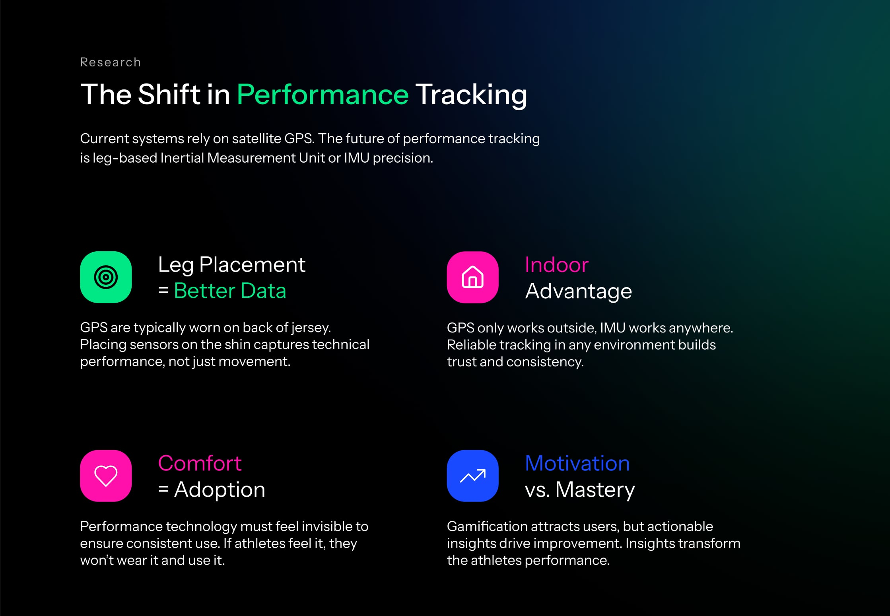
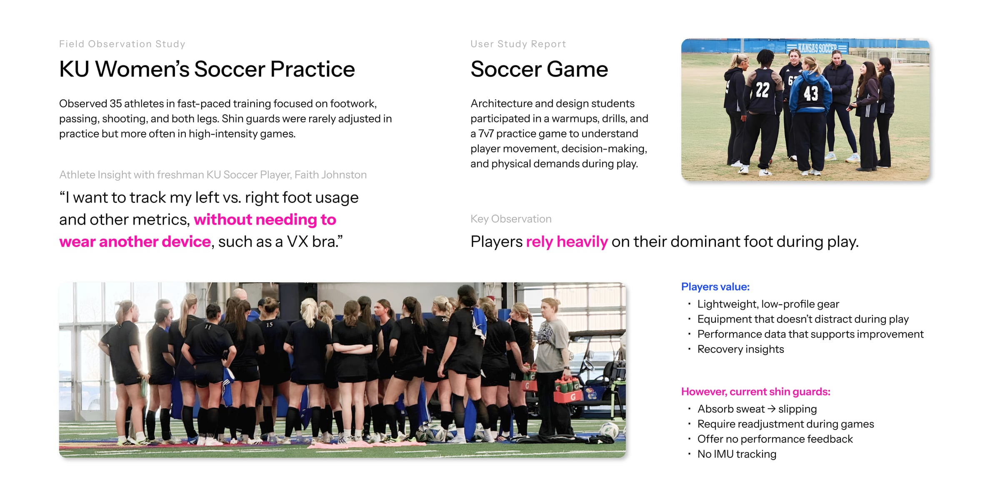
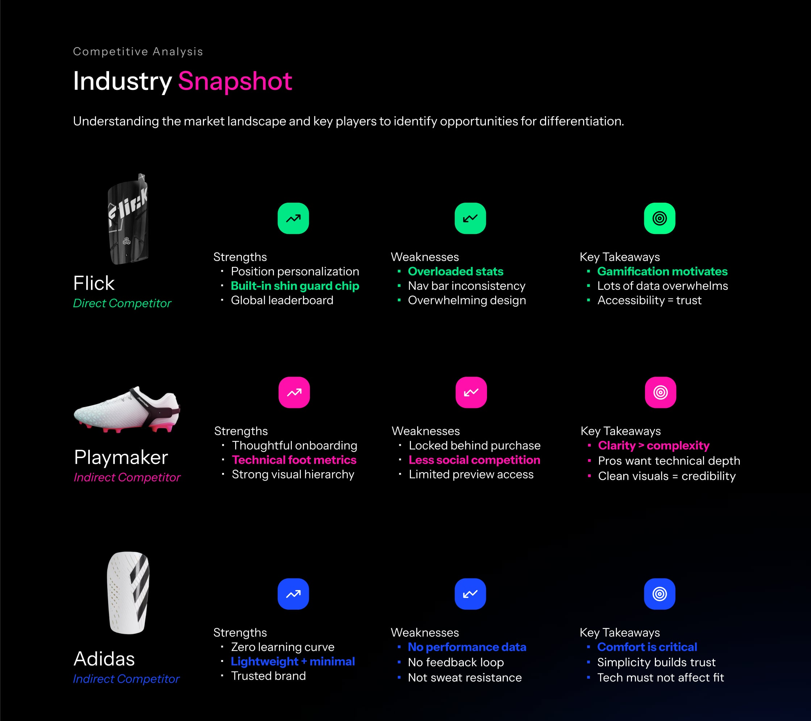
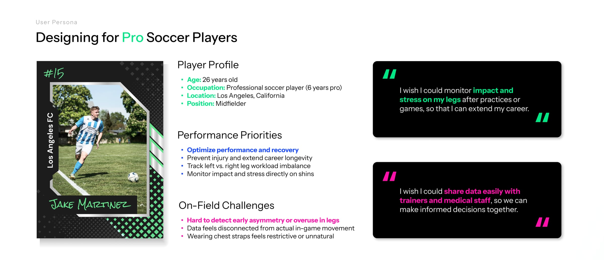
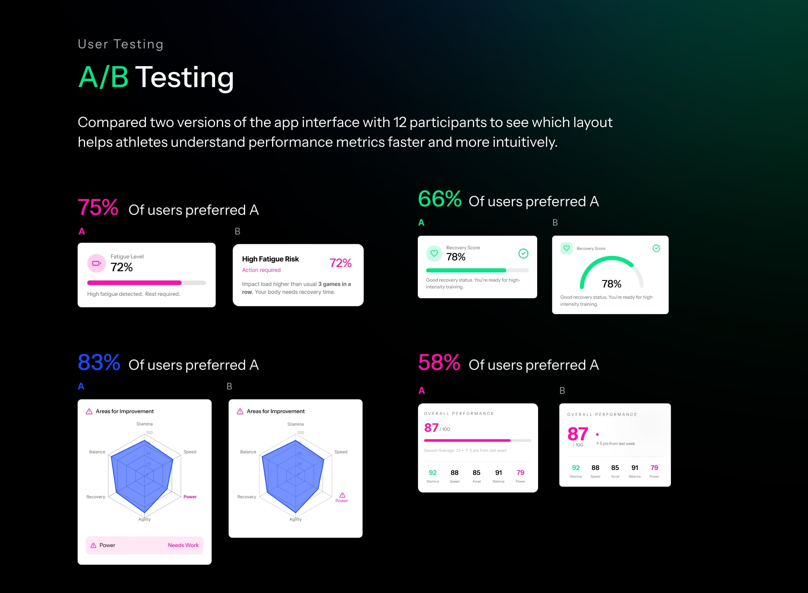
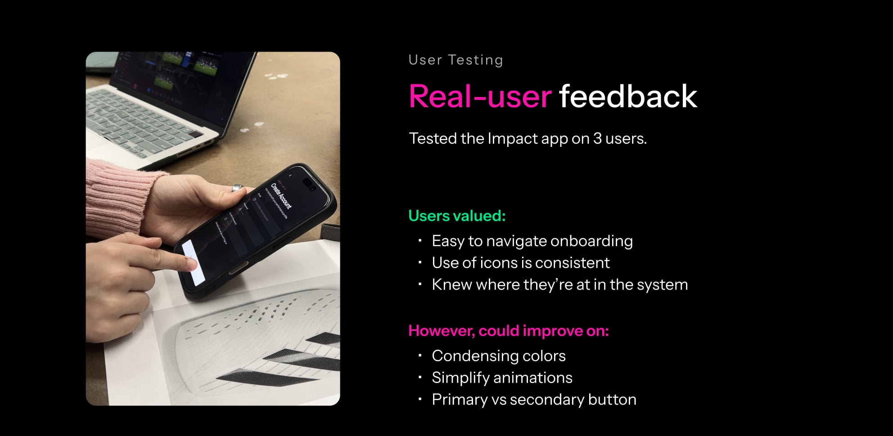
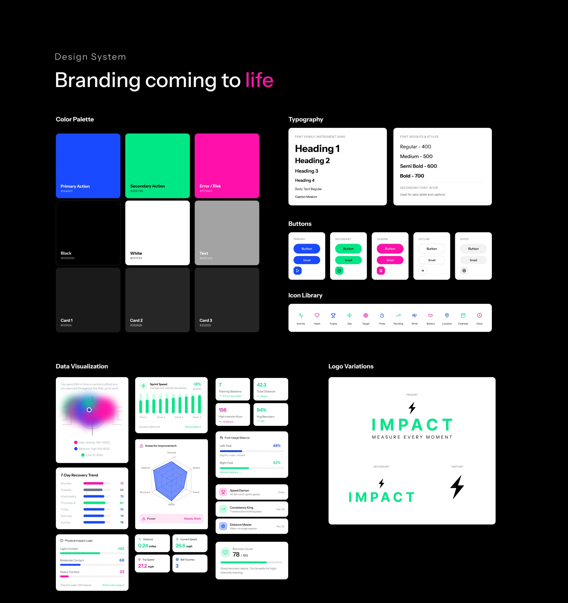

## Overview

IMPACT is a smart shin guard and companion app for the 2026 FIFA World Cup. Sensors in the shin guard measure impact, workload and recovery right at the leg, and the app turns that data into insights players can use on practice and match day.

I designed IMPACT as a solo project for IXD 412, Interaction Design 3, at the University of Kansas, from field research and competitive analysis through branding, a design system and a high-fidelity prototype.

## Problem

Performance tracking today relies on satellite GPS units worn on the back of the jersey or in a chest strap. They only work outdoors, capture movement rather than technical performance, and players find chest straps restrictive.

The shin guards players already wear don't help either: they absorb sweat and slip, need readjusting during games, and offer no performance feedback.

## Research

### The shift in performance tracking

The future of performance tracking is leg-based IMU (inertial measurement unit) precision. Four insights shaped the product:

- **Leg placement = better data.** Sensors on the shin capture technical performance, not just movement.
- **Indoor advantage.** GPS only works outside; IMU works anywhere, and reliable tracking builds trust.
- **Comfort = adoption.** Performance technology must feel invisible. If athletes feel it, they won't wear it.
- **Motivation vs. mastery.** Gamification attracts users, but actionable insights drive improvement.

### Field research

I observed 35 athletes at a KU Women's Soccer practice focused on footwork, passing, shooting and using both legs. Shin guards were rarely adjusted in practice, but more often in high-intensity games. I also ran a user study where architecture and design students played warmups, drills and a 7v7 game, to understand player movement, decision-making and physical demands.

The key observation: players rely heavily on their dominant foot.

> "I want to track my left vs. right foot usage and other metrics, without needing to wear another device, such as a VX bra." Faith Johnston, freshman KU soccer player

Players value lightweight, low-profile gear, equipment that doesn't distract during play, performance data that supports improvement, and recovery insights.

### Competitive analysis

I compared one direct and two indirect competitors:

- **Flick** (direct) offers position personalization and a built-in shin guard chip, but its stats are overloaded and the design overwhelming.
- **Playmaker** (indirect) has thoughtful onboarding and technical foot metrics, but locks features behind a purchase.
- **Adidas** shin guards (indirect) are lightweight and trusted, but offer no performance data or feedback loop.

The takeaways: clarity beats complexity, comfort is critical, and the technology must not affect fit.

### Persona

Jake Martinez is a 26-year-old professional midfielder for Los Angeles FC. He wants to optimize performance and recovery, prevent injury to extend his career, and track workload imbalance between his left and right legs, without wearing a restrictive chest strap.

> "I wish I could monitor impact and stress on my legs after practices or games, so that I can extend my career."

## Process

### User flows

I mapped the full journey from sign-up and onboarding through finding a team, pairing the shin guards and granting permissions, including error states such as a device not being found.

### A/B testing

I compared two versions of four key components with 12 participants to see which layout helped athletes understand their metrics faster. Version A won every test: 75% preferred it for fatigue alerts, 66% for the recovery score, 83% for the areas-for-improvement chart, and 58% for the overall performance card.

### Real-user feedback

I tested the prototype with 3 users. They found onboarding easy to navigate and the icons consistent, and they always knew where they were in the app. They suggested condensing the colors, simplifying the animations and making primary and secondary buttons easier to tell apart.

## Final design

The core app brings everything together: a dashboard to start sessions, insights with a position heat map and 30-day trends, recovery tracking, and a profile with achievements. Error states cover sensors that stop responding, low battery and incomplete data.

Live sessions track distance, speed, ball touches and left vs. right foot usage in real time.

### Design system

The brand pairs a dark interface with electric blue (#1A4AFF) for primary actions, green (#00E786) for secondary actions and pink (#FF10AA) for errors and risk. Type is set in Instrument Sans, with Inter for data labels and captions.

## Outcome & impact

[Placeholder: results. Grades, feedback from critique, awards, or what you'd measure if IMPACT launched.]

## Reflection

[Placeholder: what you learned and what you'd do differently next time.]
