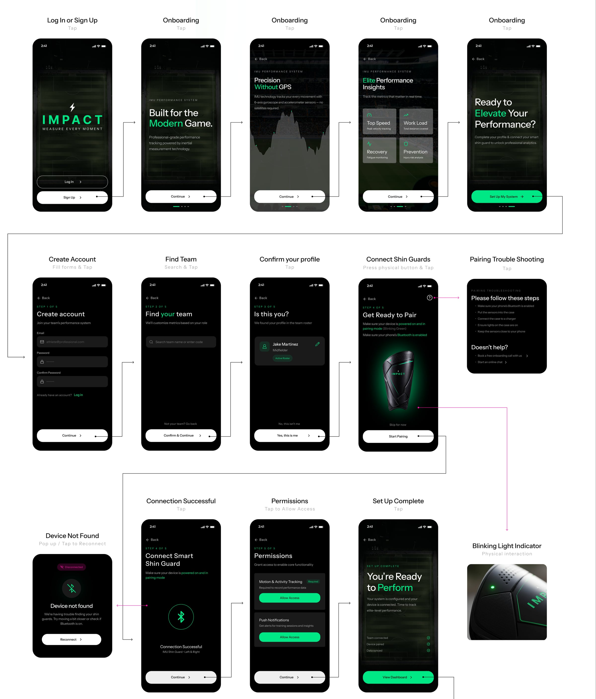
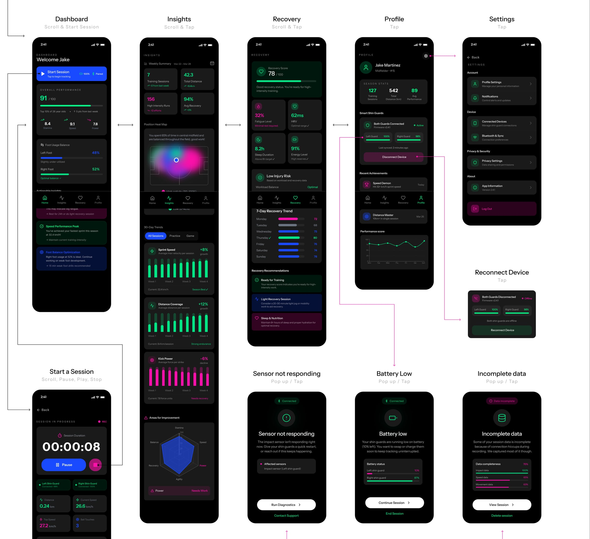
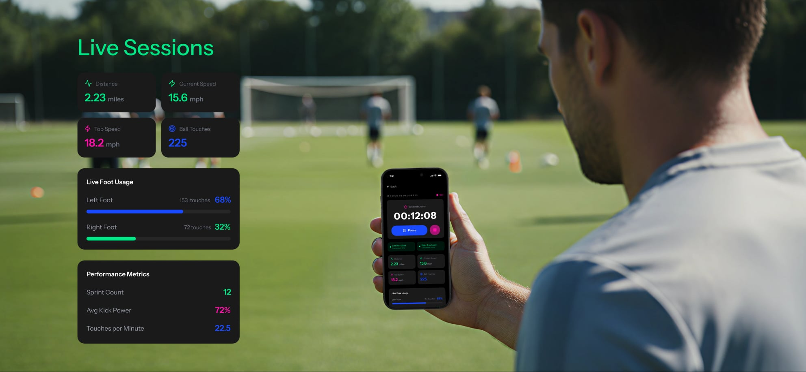
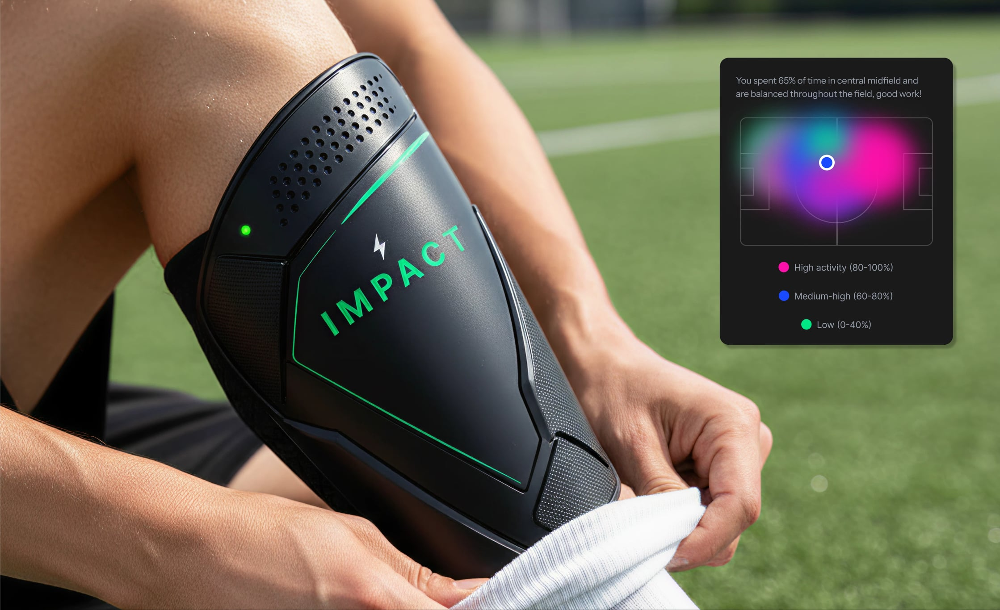

import { Image } from 'astro:assets';
import Panel from '../../components/case/Panel.astro';
import SectionTitle from '../../components/case/SectionTitle.astro';
import Insights from '../../components/case/Insights.astro';
import Features from '../../components/case/Features.astro';
import Competitors from '../../components/case/Competitors.astro';
import Persona from '../../components/case/Persona.astro';
import Stats from '../../components/case/Stats.astro';
import Checklist from '../../components/case/Checklist.astro';
import Split from '../../components/case/Split.astro';
import Swatches from '../../components/case/Swatches.astro';
import TypeSpecimen from '../../components/case/TypeSpecimen.astro';

import featureTracking from '../../assets/projects/impact/feature-tracking.jpg';
import featureRisk from '../../assets/projects/impact/feature-risk.jpg';
import featureRecovery from '../../assets/projects/impact/feature-recovery.jpg';
import photoPractice from '../../assets/projects/impact/photo-practice.jpg';
import photo7v7 from '../../assets/projects/impact/photo-7v7.jpg';
import photoTesting from '../../assets/projects/impact/photo-testing.jpg';
import personaCard from '../../assets/projects/impact/persona-card.jpg';
import flick from '../../assets/projects/impact/competitor-flick.png';
import playmaker from '../../assets/projects/impact/competitor-playmaker.png';
import adidas from '../../assets/projects/impact/competitor-adidas.png';
import abFatigue from '../../assets/projects/impact/ab-fatigue.png';
import abRecovery from '../../assets/projects/impact/ab-recovery.png';
import abImprovement from '../../assets/projects/impact/ab-improvement.png';
import abPerformance from '../../assets/projects/impact/ab-performance.png';
import dsDataViz from '../../assets/projects/impact/ds-data-viz.png';
import dsLogos from '../../assets/projects/impact/ds-logos.png';

<SectionTitle accent={1}>Overview</SectionTitle>

IMPACT is a smart shin guard and companion app for the 2026 FIFA World Cup. Sensors in the shin guard measure impact, workload and recovery right at the leg, and the app turns that data into insights players can use on practice and match day.

I designed IMPACT as a solo project for IXD 412, Interaction Design 3, at the University of Kansas, from field research and competitive analysis through branding, a design system and a high-fidelity prototype.

<Panel title="Built for Practice & Match Day" highlight="Practice & Match Day" tone="light">
  <Features
    items={[
      { icon: 'trending', accent: 1, title: 'Impact Tracking', text: 'Measures force intensity and frequency during play.', image: featureTracking, imageAlt: 'App card showing an overall performance score of 91 out of 100, with stamina, speed and power, over a close-up of a player’s cleats' },
      { icon: 'shield', accent: 2, title: 'Injury Risk Alerts', text: 'AI-driven notifications when impact exceeds safe thresholds.', image: featureRisk, imageAlt: 'App card showing low injury risk, with workload balance, training load and recovery ratio, over a match in progress' },
      { icon: 'activity', accent: 3, title: 'Recovery Integration', text: 'Syncs with post-game recovery insights and wellness metrics.', image: featureRecovery, imageAlt: 'App card showing a 78% recovery score, over two players contesting the ball' },
    ]}
  />
</Panel>

<SectionTitle accent={2}>Problem</SectionTitle>

Performance tracking today relies on satellite GPS units worn on the back of the jersey or in a chest strap. They only work outdoors, capture movement rather than technical performance, and players find chest straps restrictive.

The shin guards players already wear don't help either: they absorb sweat and slip, need readjusting during games, and offer no performance feedback.

<Panel
  level={2}
  eyebrow="Research"
  title="The Shift in Performance Tracking"
  highlight="Performance"
  intro="Current systems rely on satellite GPS. The future of performance tracking is leg-based inertial measurement unit (IMU) precision."
>
  <Insights
    items={[
      { icon: 'target', accent: 1, title: 'Leg Placement', subtitle: '= Better Data', text: 'GPS units are typically worn on the back of the jersey. Placing sensors on the shin captures technical performance, not just movement.' },
      { icon: 'home', accent: 2, title: 'Indoor', subtitle: 'Advantage', text: 'GPS only works outside; IMU works anywhere. Reliable tracking in any environment builds trust and consistency.' },
      { icon: 'heart', accent: 2, title: 'Comfort', subtitle: '= Adoption', text: 'Performance technology must feel invisible to ensure consistent use. If athletes feel it, they won’t wear it.' },
      { icon: 'trending', accent: 3, title: 'Motivation', subtitle: 'vs. Mastery', text: 'Gamification attracts users, but actionable insights drive improvement and transform an athlete’s performance.' },
    ]}
  />
</Panel>

<SectionTitle level={3} accent={3}>Field research</SectionTitle>

I observed 35 athletes at a KU Women's Soccer practice focused on footwork, passing, shooting and using both legs. Shin guards were rarely adjusted in practice, but more often in high-intensity games. I also ran a user study where architecture and design students played warmups, drills and a 7v7 game, to understand player movement, decision-making and physical demands.

The key observation: players rely heavily on their dominant foot.

<blockquote>
  
“I want to track my left vs. right foot usage and other metrics, without needing to wear another device, such as a VX bra.”

  <cite>Faith Johnston, freshman KU soccer player</cite>
</blockquote>

  <Split ratio="2fr 1fr" align="center">
    <Image slot="left" src={photoPractice} alt="The KU Women's Soccer team gathered on an indoor turf field during practice" />
    <Image slot="right" src={photo7v7} alt="Students in team jerseys huddled on a field before the 7v7 user study game" />
  </Split>

Players value lightweight, low-profile gear, equipment that doesn't distract during play, performance data that supports improvement, and recovery insights. Current shin guards absorb sweat and slip, need readjusting during games, offer no performance feedback, and have no IMU tracking.

<Panel
  eyebrow="Competitive analysis"
  title="Industry Snapshot"
  highlight="Snapshot"
  accent={2}
  intro="Understanding the market landscape and key players to identify opportunities for differentiation."
>
  <Competitors
    items={[
      {
        name: 'Flick', type: 'Direct competitor', image: flick, accent: 1,
        strengths: ['Position personalization', '!Built-in shin guard chip', 'Global leaderboard'],
        weaknesses: ['!Overloaded stats', 'Nav bar inconsistency', 'Overwhelming design'],
        takeaways: ['!Gamification motivates', 'Lots of data overwhelms', 'Accessibility = trust'],
      },
      {
        name: 'Playmaker', type: 'Indirect competitor', image: playmaker, accent: 2,
        strengths: ['Thoughtful onboarding', '!Technical foot metrics', 'Strong visual hierarchy'],
        weaknesses: ['Locked behind purchase', '!Less social competition', 'Limited preview access'],
        takeaways: ['!Clarity > complexity', 'Pros want technical depth', 'Clean visuals = credibility'],
      },
      {
        name: 'Adidas', type: 'Indirect competitor', image: adidas, accent: 3,
        strengths: ['Zero learning curve', '!Lightweight + minimal', 'Trusted brand'],
        weaknesses: ['!No performance data', 'No feedback loop', 'Not sweat resistant'],
        takeaways: ['!Comfort is critical', 'Simplicity builds trust', 'Tech must not affect fit'],
      },
    ]}
  />
</Panel>

<Panel eyebrow="User persona" title="Designing for Pro Soccer Players" highlight="Pro" tone="light">
  <Persona
    image={personaCard}
    imageAlt="Persona trading card for Jake Martinez, number 15, Los Angeles FC, dribbling a ball on grass"
    profile={[
      { label: 'Age', value: '26 years old' },
      { label: 'Occupation', value: 'Professional soccer player (6 years pro)' },
      { label: 'Location', value: 'Los Angeles, California' },
      { label: 'Position', value: 'Midfielder' },
    ]}
    priorities={[
      'Prevent injury and extend career longevity',
      'Track left vs. right leg workload imbalance',
    ]}
    challenges={[
      'Hard to detect early asymmetry or overuse in legs',
      'Wearing chest straps feels restrictive or unnatural',
    ]}
    quotes={[
      { text: 'I wish I could monitor impact and stress on my legs after practices or games, so that I can extend my career.', accent: 1 },
      { text: 'I wish I could share data easily with trainers and medical staff, so we can make informed decisions together.', accent: 1 },
    ]}
  />
</Panel>

<SectionTitle accent={3}>Process</SectionTitle>

I mapped the full journey from sign-up and onboarding through finding a team, pairing the shin guards and granting permissions, including error states such as a device not being found.

<Panel
  eyebrow="User testing"
  title="A/B Testing"
  highlight="A/B"
  intro="Compared two versions of the app interface with 12 participants to see which layout helps athletes understand performance metrics faster and more intuitively."
>
  <Stats
    items={[
      { value: '75%', label: 'of users preferred A', detail: 'Fatigue alert', accent: 2, image: abFatigue, imageAlt: 'Version A: a compact fatigue level card at 72%. Version B: a high fatigue risk alert card.' },
      { value: '66%', label: 'of users preferred A', detail: 'Recovery score', accent: 1, image: abRecovery, imageAlt: 'Version A: recovery score of 78% with a progress bar. Version B: the same score as a gauge.' },
      { value: '83%', label: 'of users preferred A', detail: 'Areas for improvement', accent: 3, image: abImprovement, imageAlt: 'Version A: radar chart with a highlighted weakest area. Version B: radar chart alone.' },
      { value: '58%', label: 'of users preferred A', detail: 'Overall performance', accent: 2, image: abPerformance, imageAlt: 'Version A: overall performance score of 87 with a progress bar. Version B: a larger score without the bar.' },
    ]}
  />
</Panel>

<Panel eyebrow="User testing" title="Real-user feedback" highlight="Real-user" accent={2} tone="light" intro="Tested the IMPACT app with 3 users.">
  <Split ratio="1fr 2fr" align="center" imageRatio="card">
    <Image slot="left" src={photoTesting} alt="A participant tapping through the IMPACT prototype on a phone, with a shin guard on the table" />
    

      <Checklist title="Users valued" accent={1} items={['Easy-to-navigate onboarding', 'Consistent use of icons', 'Knowing where they are in the system']} />
      <Checklist title="Could improve on" accent={2} items={['Condensing colors', 'Simplifying animations', 'Primary vs. secondary buttons']} />
    

  </Split>
</Panel>

<SectionTitle accent={1}>Final design</SectionTitle>

The core app brings everything together: a dashboard to start sessions, insights with a position heat map and 30-day trends, recovery tracking, and a profile with achievements. Error states cover sensors that stop responding, low battery and incomplete data.

<Panel eyebrow="Design system" title="Branding coming to life" highlight="life" accent={2}>
  <Swatches
    colors={[
      { name: 'Primary action', hex: '#1A4AFF' },
      { name: 'Secondary action', hex: '#00E786' },
      { name: 'Error / risk', hex: '#FF10AA' },
      { name: 'Black', hex: '#000000' },
      { name: 'White', hex: '#FFFFFF' },
      { name: 'Text', hex: '#A3A3A3' },
      { name: 'Card 1', hex: '#1A1A1A' },
      { name: 'Card 2', hex: '#262626' },
    ]}
  />

  

    <TypeSpecimen family="Instrument Sans" role="Primary: headings and body" weights={[{ name: 'Regular', value: 400 }, { name: 'Medium', value: 500 }, { name: 'Semi Bold', value: 600 }, { name: 'Bold', value: 700 }]} />
    <TypeSpecimen family="Inter" role="Secondary: data labels and captions" sample="Top Speed 27.2 km/h" weights={[{ name: 'Regular', value: 400 }, { name: 'Medium', value: 500 }]} />
  

  <Split ratio="3fr 2fr">
    <Fragment slot="left">
      <h4>Data visualization</h4>
      <Image src={dsDataViz} alt="Data visualization components: heat map, sprint speed bars, radar chart, weekly summary, recovery trend, foot usage balance and achievements" />
    </Fragment>
    <Fragment slot="right">
      <h4>Logo variations</h4>
      <Image src={dsLogos} alt="IMPACT logo variations: primary lockup with tagline, secondary wordmark, and the lightning bolt mark" />
    </Fragment>
  </Split>
</Panel>
